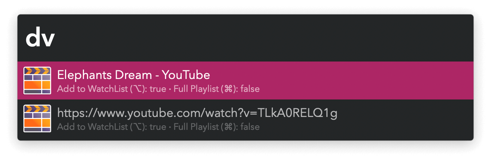
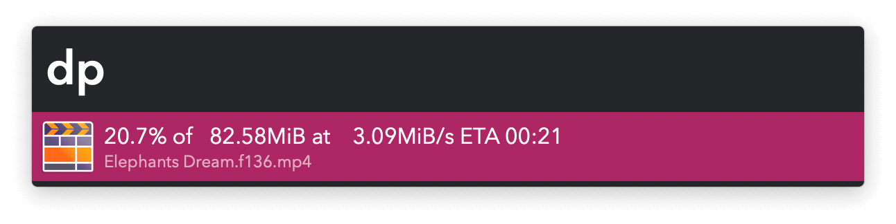

#  Download Media Alfred Workflow

Download video and audio from web pages

<a href='https://alfred.app/workflows/vitor/download-media'>⤓ Install From the Alfred Gallery</a>

## Usage

Download from [a plethora of online sources](https://github.com/yt-dlp/yt-dlp/blob/master/supportedsites.md) via the Download Video Keyword (default: `dv`) and Download Audio Keyword (default: `da`). Your clipboard and frontmost browser tab are checked for links.

* <kbd>⏎</kbd>: Download.
* <kbd>⌘</kbd><kbd>⏎</kbd>: Download full playlist.
* <kbd>⌥</kbd><kbd>⏎</kbd>: Toggle adding to [Watch List](https://alfred.app/workflows/vitor/watch-list).

Alternatively, download with the [Universal Action](https://www.alfredapp.com/help/features/universal-actions/).

Check download progress via the Progress Keyword (default: `dp`).

* <kbd>⌘</kbd><kbd>⏎</kbd>: Restart download.
* <kbd>⌃</kbd><kbd>⏎</kbd>: Cancel.
