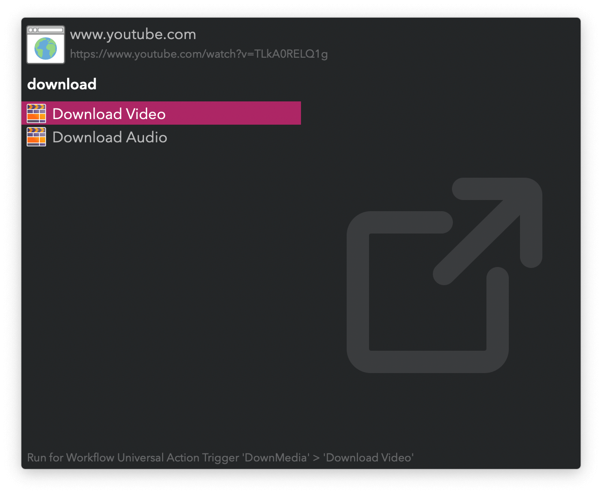

#  Download Media Alfred Workflow

Download video and audio from web pages

[⤓ Install on the Alfred Gallery](https://alfred.app/workflows/vitor/download-media)

## Usage

Download video from [a plethora of online sources](https://github.com/yt-dlp/yt-dlp/blob/master/supportedsites.md) via the `dv` keyword. Download audio with `da`. Your clipboard and frontmost browser tab are checked for links.

* <kbd>↩&#xFE0E;</kbd>: Download.
* <kbd>⌘</kbd><kbd>↩&#xFE0E;</kbd>: Download full playlist.
* <kbd>⌥</kbd><kbd>↩&#xFE0E;</kbd>: Toggle adding to [Watch List](https://alfred.app/workflows/vitor/watch-list).

Alternatively, download with the [Universal Action](https://www.alfredapp.com/help/features/universal-actions/).

Check download progress via the `dp` keyword.

* <kbd>⌘</kbd><kbd>↩&#xFE0E;</kbd>: Restart download.
* <kbd>⌃</kbd><kbd>↩&#xFE0E;</kbd>: Cancel.
